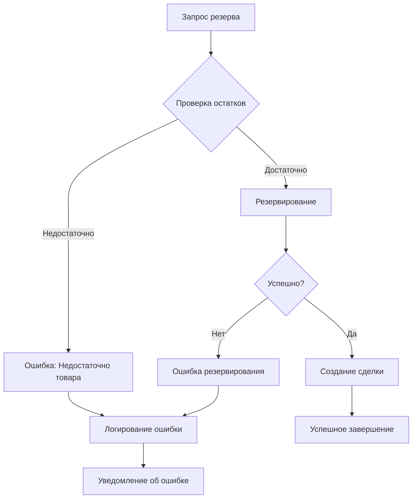

# Система резервирования товаров n8n + Битрикс24

## 🎯 Архитектура системы

### Основные компоненты:
1. **Триггер** - запуск по расписанию или webhook
2. **Получение данных** - из Google Sheets или внешних источников
3. **Проверка остатков** - через API Битрикс24
4. **Логика резервирования** - обработка и валидация
5. **Обновление остатков** - в Битрикс24
6. **Создание сделок/задач** - в CRM
7. **Логирование** - запись операций
8. **Уведомления** - различные каналы связи

---

## 🔧 Ноды (узлы) для использования

### 1. Триггеры
- **Cron** - для периодического запуска
- **Webhook** - для внешних запросов
- **Google Sheets Trigger** - при изменении таблицы
- **Manual Trigger** - для тестирования

### 2. Обработка данных
- **Google Sheets** - чтение/запись данных
- **HTTP Request** - API запросы к Битрикс24
- **Code** - JavaScript для сложной логики
- **Set** - установка переменных
- **IF** - условная логика
- **Switch** - множественные условия

### 3. Обработка ошибок
- **Error Trigger** - обработка ошибок
- **Stop and Error** - остановка с ошибкой
- **No Op** - пропуск операций

### 4. Уведомления
- **Telegram** - сообщения в Telegram
- **Email Send** - отправка email
- **Slack** - уведомления в Slack
- **HTTP Request** - webhook уведомления

---

## ⏰ Настройка триггеров

### 1. Cron триггер (расписание)
```javascript
// Каждые 15 минут в рабочее время
0 */15 8-18 * * 1-5

// Каждый час
0 0 * * * *

// Каждый день в 9:00
0 0 9 * * *
```

### 2. Webhook триггер
```javascript
// Настройки webhook
{
  "httpMethod": "POST",
  "path": "inventory-reserve",
  "authentication": "headerAuth",
  "options": {
    "noResponseBody": false
  }
}

// Пример запроса
POST /webhook/inventory-reserve
{
  "product_id": "123",
  "quantity": 5,
  "customer_id": "456",
  "reserve_type": "order"
}
```

### 3. Google Sheets триггер
```javascript
// Настройки
{
  "triggerOn": "rowAdded",
  "sheetName": "Резервы",
  "pollInterval": 60000
}
```

---

## 🛡️ Обработка ошибок

### 1. Схема обработки ошибок


### 2. Код обработки ошибок
```javascript
// В ноде Code для проверки остатков
const items = $input.all();
const results = [];

for (const item of items) {
  try {
    const productId = item.json.product_id;
    const requestedQty = item.json.quantity;
    const currentStock = item.json.current_stock;
    
    if (currentStock < requestedQty) {
      results.push({
        json: {
          status: 'error',
          error_type: 'insufficient_stock',
          message: `Недостаточно товара. Доступно: ${currentStock}, запрошено: ${requestedQty}`,
          product_id: productId,
          available_quantity: currentStock,
          requested_quantity: requestedQty
        }
      });
    } else {
      results.push({
        json: {
          status: 'success',
          product_id: productId,
          reserved_quantity: requestedQty,
          remaining_stock: currentStock - requestedQty
        }
      });
    }
  } catch (error) {
    results.push({
      json: {
        status: 'error',
        error_type: 'processing_error',
        message: error.message,
        item: item.json
      }
    });
  }
}

return results;
```

---

## 📡 API Битрикс24

### 1. Получение остатков товаров
```javascript
// HTTP Request нода
{
  "method": "POST",
  "url": "https://your-bitrix24.bitrix24.ru/rest/1/webhook_key/catalog.product.list",
  "body": {
    "filter": {
      "ACTIVE": "Y",
      "!QUANTITY": 0
    },
    "select": [
      "ID",
      "NAME", 
      "QUANTITY",
      "MEASURE",
      "PRICE"
    ]
  }
}

// Альтернативный метод для складских остатков
{
  "method": "POST", 
  "url": "https://your-bitrix24.bitrix24.ru/rest/1/webhook_key/catalog.store.product.list",
  "body": {
    "filter": {
      "PRODUCT_ID": "123"
    },
    "select": [
      "PRODUCT_ID",
      "STORE_ID", 
      "AMOUNT"
    ]
  }
}
```

### 2. Обновление остатков
```javascript
// Обновление количества товара
{
  "method": "POST",
  "url": "https://your-bitrix24.bitrix24.ru/rest/1/webhook_key/catalog.product.update",
  "body": {
    "id": "{{ $json.product_id }}",
    "fields": {
      "QUANTITY": "{{ $json.new_quantity }}"
    }
  }
}

// Создание записи движения товара
{
  "method": "POST",
  "url": "https://your-bitrix24.bitrix24.ru/rest/1/webhook_key/catalog.document.add",
  "body": {
    "fields": {
      "DOC_TYPE": "S",
      "SITE_ID": "s1",
      "CURRENCY": "RUB",
      "STATUS": "Y",
      "ELEMENTS": [
        {
          "STORE_FROM": 1,
          "ELEMENT_ID": "{{ $json.product_id }}",
          "AMOUNT": "{{ $json.reserved_quantity }}"
        }
      ]
    }
  }
}
```

### 3. Создание сделки при резервировании
```javascript
// Создание сделки
{
  "method": "POST",
  "url": "https://your-bitrix24.bitrix24.ru/rest/1/webhook_key/crm.deal.add",
  "body": {
    "fields": {
      "TITLE": "Резерв товара #{{ $json.product_id }}",
      "STAGE_ID": "NEW",
      "CURRENCY_ID": "RUB",
      "OPPORTUNITY": "{{ $json.total_amount }}",
      "CONTACT_ID": "{{ $json.customer_id }}",
      "UF_CRM_DEAL_RESERVED_QTY": "{{ $json.reserved_quantity }}",
      "UF_CRM_DEAL_PRODUCT_ID": "{{ $json.product_id }}",
      "UF_CRM_DEAL_RESERVE_DATE": "{{ $now }}"
    }
  }
}

// Создание задачи
{
  "method": "POST",
  "url": "https://your-bitrix24.bitrix24.ru/rest/1/webhook_key/tasks.task.add",
  "body": {
    "fields": {
      "TITLE": "Обработать резерв товара",
      "DESCRIPTION": "Товар: {{ $json.product_name }}\nКоличество: {{ $json.reserved_quantity }}\nКлиент: {{ $json.customer_name }}",
      "RESPONSIBLE_ID": 1,
      "DEADLINE": "{{ $json.deadline }}",
      "PRIORITY": "1"
    }
  }
}
```

---

## 📝 Логирование

### 1. Запись в Google Sheets
```javascript
// Google Sheets нода для логирования
{
  "operation": "append",
  "sheetName": "Лог операций",
  "values": [
    [
      "{{ $now }}",
      "{{ $json.operation_type }}",
      "{{ $json.product_id }}",
      "{{ $json.quantity }}",
      "{{ $json.status }}",
      "{{ $json.message }}",
      "{{ $json.user_id }}"
    ]
  ]
}
```

### 2. Структура лог-файла
```javascript
// Code нода для записи в лог
const fs = require('fs');
const path = '/tmp/inventory_log.json';

const logEntry = {
  timestamp: new Date().toISOString(),
  operation: $json.operation_type,
  product_id: $json.product_id,
  quantity: $json.quantity,
  status: $json.status,
  message: $json.message,
  user_id: $json.user_id,
  session_id: $json.session_id
};

// Чтение существующего лога
let logs = [];
try {
  const data = fs.readFileSync(path, 'utf8');
  logs = JSON.parse(data);
} catch (error) {
  // Файл не существует, создаем новый массив
}

logs.push(logEntry);

// Сохранение обновленного лога
fs.writeFileSync(path, JSON.stringify(logs, null, 2));

return [{ json: logEntry }];
```

---

## 🔔 Уведомления

### 1. Telegram уведомления
```javascript
// Telegram нода
{
  "chatId": "{{ $json.telegram_chat_id }}",
  "text": `🔄 *Резервирование товара*
  
📦 Товар: {{ $json.product_name }}
📊 Количество: {{ $json.reserved_quantity }}
👤 Клиент: {{ $json.customer_name }}
✅ Статус: {{ $json.status }}
📅 Дата: {{ $now.format('DD.MM.YYYY HH:mm') }}

{{ $json.status === 'error' ? '❌ Ошибка: ' + $json.message : '✅ Успешно зарезервировано' }}`,
  "parseMode": "Markdown"
}
```

### 2. Email уведомления
```javascript
// Email Send нода
{
  "fromEmail": "noreply@company.com",
  "toEmail": "{{ $json.manager_email }}",
  "subject": "Резервирование товара - {{ $json.status === 'success' ? 'Успешно' : 'Ошибка' }}",
  "text": `Детали операции:
  
Товар: {{ $json.product_name }} (ID: {{ $json.product_id }})
Количество: {{ $json.reserved_quantity }}
Клиент: {{ $json.customer_name }}
Статус: {{ $json.status }}
Время: {{ $now }}

{{ $json.message }}`
}
```

### 3. Уведомления в чат Битрикс24
```javascript
// HTTP Request для чата Битрикс24
{
  "method": "POST",
  "url": "https://your-bitrix24.bitrix24.ru/rest/1/webhook_key/im.message.add",
  "body": {
    "DIALOG_ID": "chatXXX",
    "MESSAGE": `📦 Резервирование товара
    
Товар: {{ $json.product_name }}
Количество: {{ $json.reserved_quantity }}
Статус: {{ $json.status === 'success' ? '✅ Успешно' : '❌ Ошибка' }}
{{ $json.message }}`
  }
}
```

---

## ⚡ Оптимизация производительности

### 1. Избежание лишних API-запросов

#### Batch обработка
```javascript
// Code нода для группировки запросов
const items = $input.all();
const batchSize = 50;
const batches = [];

for (let i = 0; i < items.length; i += batchSize) {
  batches.push(items.slice(i, i + batchSize));
}

return batches.map(batch => ({ json: { batch } }));
```

#### Условные запросы
```javascript
// IF нода - проверка необходимости запроса
{
  "conditions": {
    "string": [
      {
        "value1": "={{ $json.last_check_time }}",
        "operation": "isNotEmpty"
      },
      {
        "value1": "={{ $now.minus({minutes: 15}).toISO() }}",
        "value2": "={{ $json.last_check_time }}",
        "operation": "after"
      }
    ]
  }
}
```

### 2. Кеширование данных

#### Использование переменных workflow
```javascript
// Code нода для кеширования
const cacheKey = `product_${$json.product_id}`;
const cacheTimeout = 5 * 60 * 1000; // 5 минут

// Проверка кеша
const cached = $workflow.cache?.[cacheKey];
if (cached && (Date.now() - cached.timestamp) < cacheTimeout) {
  return [{ json: cached.data }];
}

// Данные не в кеше или устарели - делаем запрос
const response = await $http.request({
  method: 'POST',
  url: 'https://your-bitrix24.bitrix24.ru/rest/1/webhook_key/catalog.product.get',
  body: { id: $json.product_id }
});

// Сохраняем в кеш
if (!$workflow.cache) $workflow.cache = {};
$workflow.cache[cacheKey] = {
  data: response.result,
  timestamp: Date.now()
};

return [{ json: response.result }];
```

#### Использование внешнего кеша (Redis)
```javascript
// Code нода с Redis
const Redis = require('redis');
const client = Redis.createClient({
  host: 'redis-server',
  port: 6379
});

const cacheKey = `bitrix_product_${$json.product_id}`;
const cachedData = await client.get(cacheKey);

if (cachedData) {
  return [{ json: JSON.parse(cachedData) }];
}

// Запрос к API и сохранение в кеш
const apiResponse = await makeApiRequest();
await client.setex(cacheKey, 300, JSON.stringify(apiResponse)); // 5 минут

return [{ json: apiResponse }];
```

---

## 🚀 Дополнительные улучшения

### 1. Подтверждение резерва через кнопку

#### Telegram с inline кнопками
```javascript
// Telegram нода с кнопками
{
  "chatId": "{{ $json.manager_chat_id }}",
  "text": `🔄 *Запрос на резервирование*
  
📦 Товар: {{ $json.product_name }}
📊 Количество: {{ $json.requested_quantity }}
📈 Доступно: {{ $json.available_quantity }}
👤 Клиент: {{ $json.customer_name }}`,
  "parseMode": "Markdown",
  "replyMarkup": {
    "inline_keyboard": [
      [
        {
          "text": "✅ Подтвердить",
          "callback_data": `confirm_reserve_{{ $json.request_id }}`
        },
        {
          "text": "❌ Отклонить", 
          "callback_data": `reject_reserve_{{ $json.request_id }}`
        }
      ]
    ]
  }
}
```

#### Webhook для обработки подтверждений
```javascript
// Webhook нода для callback
{
  "httpMethod": "POST",
  "path": "telegram-callback",
  "responseMode": "responseNode"
}

// Code нода для обработки callback
const callbackData = $json.callback_query.data;
const [action, requestId] = callbackData.split('_').slice(0, 2);

if (action === 'confirm') {
  // Выполняем резервирование
  return [{
    json: {
      action: 'confirm_reserve',
      request_id: requestId,
      user_id: $json.callback_query.from.id
    }
  }];
} else if (action === 'reject') {
  // Отклоняем резерв
  return [{
    json: {
      action: 'reject_reserve', 
      request_id: requestId,
      user_id: $json.callback_query.from.id
    }
  }];
}
```

### 2. Отчеты по истории изменений

#### Создание отчета в Google Sheets
```javascript
// Code нода для генерации отчета
const startDate = $json.start_date;
const endDate = $json.end_date;

// Получаем данные из лога
const logs = await getLogsFromDatabase(startDate, endDate);

// Группируем по товарам
const report = {};
logs.forEach(log => {
  if (!report[log.product_id]) {
    report[log.product_id] = {
      product_name: log.product_name,
      total_reserved: 0,
      total_released: 0,
      operations: []
    };
  }
  
  if (log.operation === 'reserve') {
    report[log.product_id].total_reserved += log.quantity;
  } else if (log.operation === 'release') {
    report[log.product_id].total_released += log.quantity;
  }
  
  report[log.product_id].operations.push(log);
});

// Формируем данные для таблицы
const reportData = Object.values(report).map(item => [
  item.product_name,
  item.total_reserved,
  item.total_released,
  item.total_reserved - item.total_released,
  item.operations.length
]);

return [{ json: { reportData } }];
```

#### Автоматическая отправка отчетов
```javascript
// Cron триггер для еженедельных отчетов
// 0 0 9 * * 1 (каждый понедельник в 9:00)

// Google Sheets нода для создания отчета
{
  "operation": "create",
  "sheetName": "Отчет {{ $now.format('YYYY-MM-DD') }}",
  "headerRow": [
    "Товар",
    "Зарезервировано", 
    "Освобождено",
    "Текущий резерв",
    "Операций"
  ],
  "values": "{{ $json.reportData }}"
}

// Email отчет менеджерам
{
  "fromEmail": "reports@company.com",
  "toEmail": "managers@company.com",
  "subject": "Еженедельный отчет по резервам {{ $now.format('DD.MM.YYYY') }}",
  "attachments": [
    {
      "name": "inventory_report.xlsx",
      "data": "{{ $json.excel_data }}"
    }
  ]
}
```

---

## 📋 Пример полного workflow

### Основной workflow резервирования:

1. **Webhook Trigger** → получение запроса
2. **Set Node** → установка переменных
3. **HTTP Request** → проверка остатков в Битрикс24
4. **IF Node** → проверка достаточности товара
5. **Code Node** → расчет нового остатка
6. **HTTP Request** → обновление остатков
7. **HTTP Request** → создание сделки
8. **Google Sheets** → логирование операции
9. **Telegram** → уведомление менеджера
10. **Respond to Webhook** → ответ клиенту

### Workflow обработки ошибок:

1. **Error Trigger** → перехват ошибок
2. **Code Node** → анализ типа ошибки
3. **Switch Node** → выбор действия по типу ошибки
4. **Google Sheets** → логирование ошибки
5. **Telegram** → уведомление об ошибке
6. **Email** → отправка детального отчета

Эта система обеспечивает надежное резервирование товаров с полным контролем, логированием и уведомлениями.